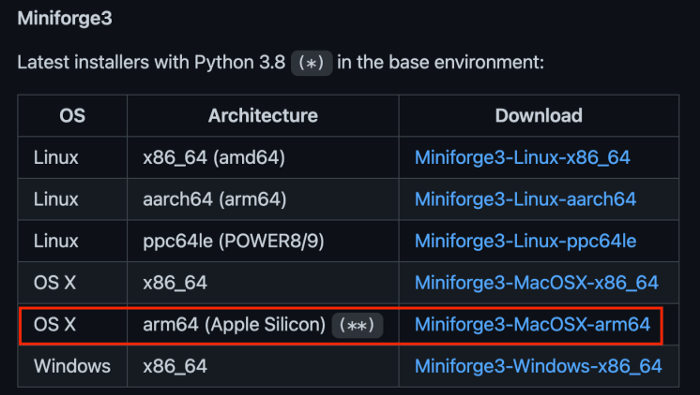
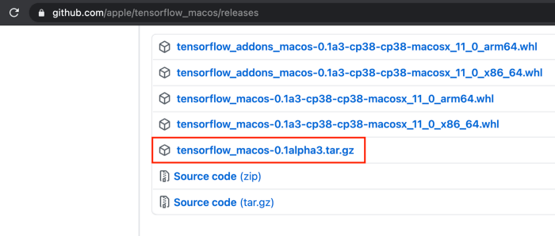

## Install tensorflow for Mac-M1
I refer the [link](https://makeoptim.com/en/deep-learning/mac-m1-tensorflow)

- Install Xcode command line
```shell
$ xcode-select --install
```

- Install Homebrew:
```shell
$ /bin/bash -c "$(curl -fsSL https://raw.githubusercontent.com/Homebrew/install/HEAD/install.sh)"
```

- Install Miniforge
> Anaconda cannot run on M1, Miniforge is used to replace it.

Download the Miniforge3-MacOSX-arm64 from https://github.com/conda-forge/miniforge.



Install Miniforge using the terminal.
```shell
$ bash Miniforge3-MacOSX-arm64.sh

```

- Install Apple Tensorflow:
Download TensorFlow from https://github.com/apple/tensorflow_macos/releases, untar it, and go under the arm64 directory
  



## Create virtual environment
- Create and activate a conda virtual environment with python 3.8 (as required for ATF 2.4).
```shell
$ conda create -n tensorflow python=3.8
$ conda activate tensorflow
```
- Install needed packages
```shell
$ brew install libjpeg
$ conda install -y pandas matplotlib scikit-learn jupyterlab
```
> Note: libjpeg is a required dependency for matplotlib.
- Install specific pip version and some other base packages
```shell
$ pip install --force pip==20.2.4 wheel setuptools cached-property six packaging
```
> Note: Apple TensorFlow needs a specific pip version.

- Install packages(numpy, grpcio, h5py) provided by Apple
```shell
$ pip install --upgrade --no-dependencies --force numpy-1.18.5-cp38-cp38-macosx_11_0_arm64.whl grpcio-1.33.2-cp38-cp38-macosx_11_0_arm64.whl h5py-2.10.0-cp38-cp38-macosx_11_0_arm64.whl
```

- Install additional packages
```shell
$ pip install absl-py astunparse flatbuffers gast google_pasta keras_preprocessing opt_einsum protobuf tensorflow_estimator termcolor typing_extensions wrapt wheel tensorboard typeguard
```
- Install TensorFlow
```shell
$ pip install --upgrade --no-dependencies --force tensorflow_macos-0.1a3-cp38-cp38-macosx_11_0_arm64.whl
$ pip install --upgrade --no-dependencies --force tensorflow_addons_macos-0.1a3-cp38-cp38-macosx_11_0_arm64.whl
```

- Finally, upgrade the pip to give the developers the correct version.
```shell
$ pip install --upgrade pip
```

## Create Jupyter Notebook
- To run/open Jupyter Notebook by command `jupyter notebook`
- To fix cannot connect debug jupyter by: make sure `ipykernel` is version `6.2.0`:
If current version is not `6.2.0`, need to uninstall and install with specified version (`6.2.0`)
```shell
pip uninstall ipykernel
pip install ipykernel==6.2.0
```
